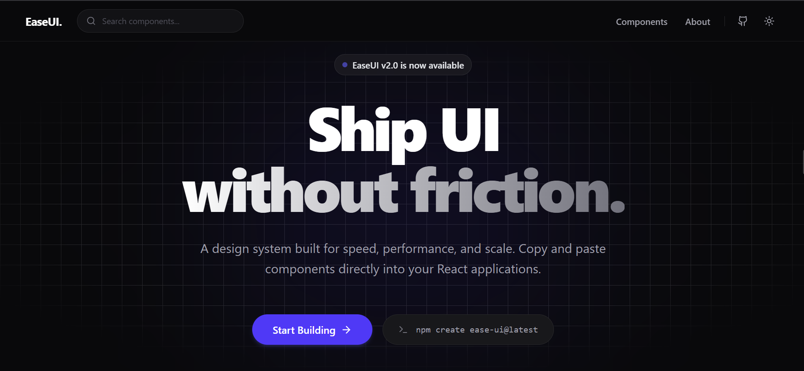

<div align="center">
  <a href="https://github.com/abdur4code/easeui">
    
  </a>
  
  <br />
  <br />

  <h1 align="center">EaseUI</h1>

  <p align="center">
    <strong>Ship UI without friction.</strong>
    <br />
    A beautifully crafted, accessible, and highly customizable React component library built for modern web applications.
  </p>

  <p align="center">
    
    
    
    
    
    
  </p>
</div>

<br />

## 📖 The Legacy of EaseUI

> *What starts as a lesson can evolve into a legacy.*

EaseUI **v1.0** was originally conceived by my instructor, **Devendra Dhote**, as a foundational project. It featured a few core UI components designed to demonstrate basic website structuring and component architecture. 

He handed me the codebase with a simple challenge: *Understand the architecture and improve it.* 

Through deep dedication and countless hours of engineering, I completely rebuilt the system. **EaseUI v2.0** introduces a massively expanded suite of production-ready components, a dedicated interactive documentation site, and robust architectural improvements. This repository is a testament to that journey of learning and scaling.

---

## ✨ Features

*   **⚡️ Zero-Friction Integration:** No heavy npm installs or hidden dependencies. Just copy, paste, and customize the components directly into your codebase.
*   **🛡 Strictly Typed:** Written entirely in TypeScript to provide flawless IDE intellisense and catch errors before they hit production.
*   **🎨 Highly Customizable:** Built on Tailwind CSS, making it incredibly simple to override default styles, colors, and layouts to match your brand.
*   **✨ Interactive Animations:** Integrated with GSAP for smooth, hardware-accelerated entrance and hover animations right out of the box.
*   **📚 Comprehensive Documentation:** A fully featured showcase website with IDE-style code snippets, live previews, and dynamic props tables.

<br />

## 🛠 Tech Stack

The components and the documentation site are built utilizing the following technologies:
*   **React** (UI Framework)
*   **Tailwind CSS** (Styling & Layouts)
*   **TypeScript** (Static Typing)
*   **Redux Toolkit** (State management for the documentation environment)
*   **Lucide React** (Icons)
*   **GSAP** (Complex Animations)

<br />

## 🚀 Quick Start

EaseUI is designed to be a "copy-paste" library. You do not need to install it as an npm package. 

### 1. Prerequisites
Ensure your project is set up with **React** and **Tailwind CSS**. 

### 2. Add Components
Browse the `src/components` directory in this repository, select the components you need, and copy them directly into your project's component folder.

### 3. Usage Example
Once copied, you can import and use the components immediately. They will automatically inherit your project's Tailwind configuration.

<br />

```tsx
import { Card } from "@/components/Card";
import { Button } from "@/components/Button";

export default function Showcase() {
  return (
    <Card <Button animate="{true}" description="This card fades in and features a floating effect on hover!" footer="{" hoverAnimation="jiggle" title="Modern Animated Card" variant="primary">
          Deploy Now
        </Button>
      }
    />
  );
}
```

<br />

## 📚 Interactive Documentation

To truly understand what EaseUI offers, you can run our documentation website locally. It provides an interactive environment to explore the components, view API reference tables, and copy code snippets.

### Running the Docs Locally

```bash
# Clone the repository
git clone https://github.com/abdur4code/easeui.git


# Navigate to the directory
cd easeui

# Install dependencies
npm install

# Start the development server
npm run dev

```

Navigate to `http://localhost:5173` to interact with the live component gallery and explore the documentation.

---

## 🤝 Contributing

Contributions make the open-source community an amazing place to learn, inspire, and create. Any contributions you make to EaseUI are **greatly appreciated**.

1. Fork the Project
2. Create your Feature Branch (`git checkout -b feature/AmazingFeature`)
3. Commit your Changes (`git commit -m 'Add some AmazingFeature'`)
4. Push to the Branch (`git push origin feature/AmazingFeature`)
5. Open a Pull Request
